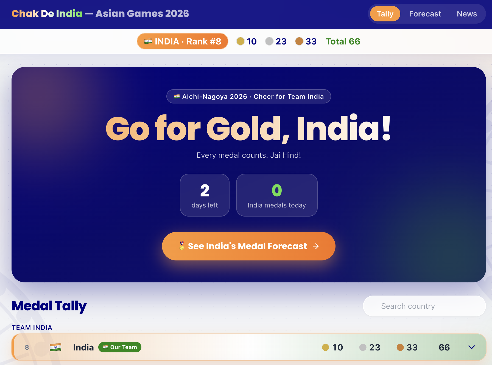
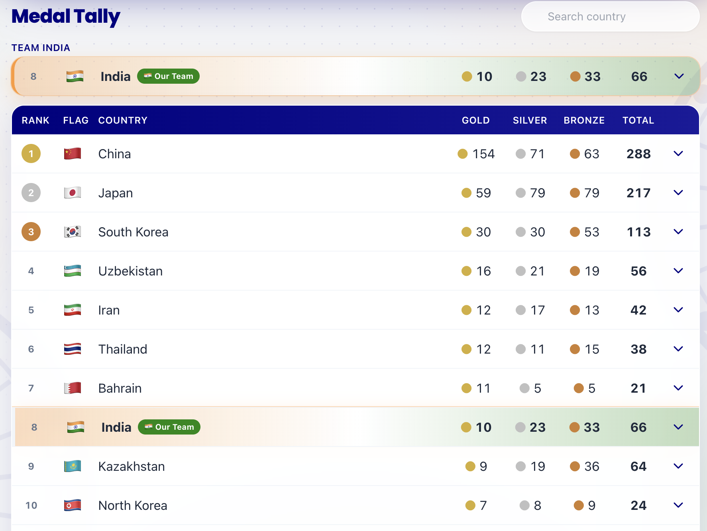
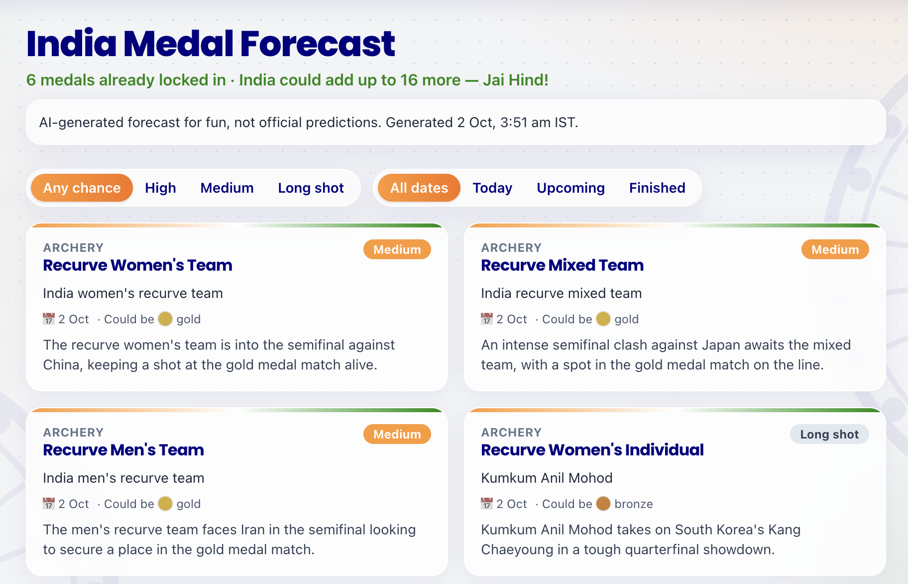
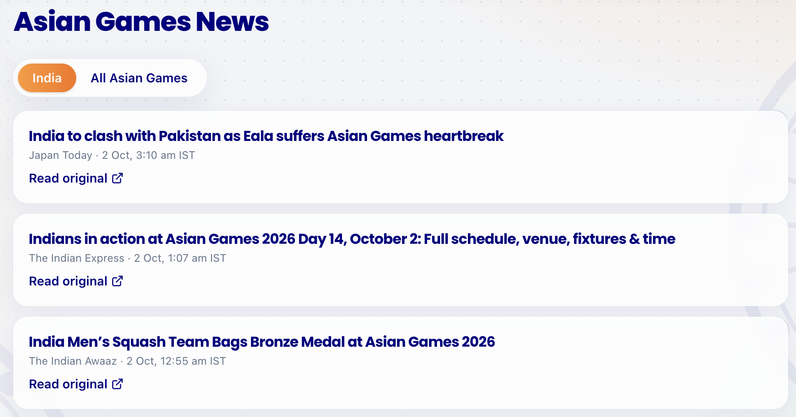
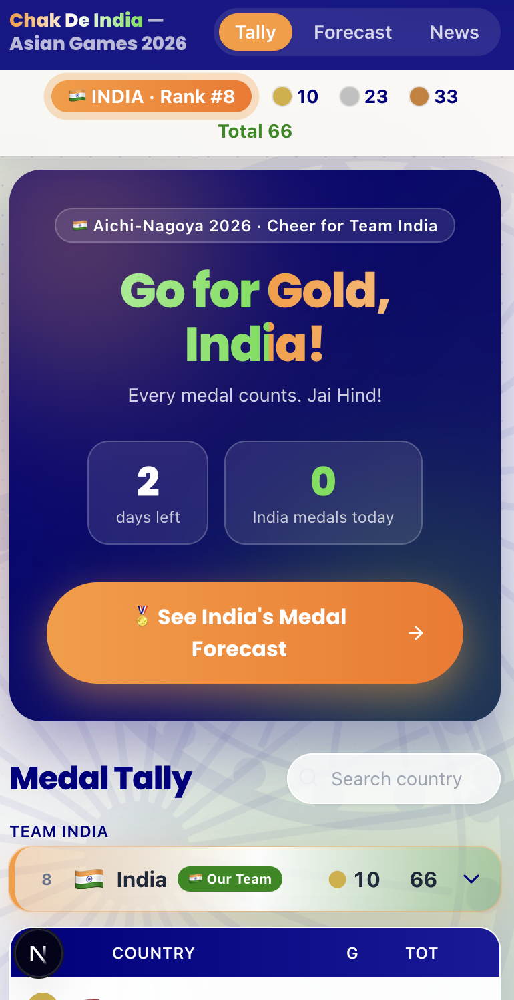

<div align="center">

# 🇮🇳 Chak De India — Asian Games 2026

**Follow the Asian Games through India's eyes: the medal table, what's still to come, and the news that matters, all in one place.**

[**🔴 Live demo**](https://asian-games-forecast-generator.vercel.app)

<!-- TODO: replace the link above with your deployed Vercel URL -->

</div>

---

## Why this exists

Most medal tables treat India like any other country, and the news is scattered across a dozen sites. This page is made for supporters. India is always highlighted, you can see which medals are still possible today and tomorrow, and the latest India headlines sit right next to the tally.

It answers the questions Indian fans actually ask during the Games:

- **Where does India stand right now?**
- **Which events should I watch today, and where could the next medal come from?**
- **What's the news about Team India?**

## 📸 Demo

<!-- TODO: add your screenshots to docs/screenshots/ using these file names (or change the paths below). -->

### Front page
The first thing visitors see: a cheering hero, days left, India's medals today and a one-tap link to the forecast.



### Medal Tally
India is always highlighted and pinned above the table. Open any country to see its medals by sport, athlete and date.



### India Medal Forecast
Every event where India can still win a medal, rated High, Medium or Long shot, with a short reason.



### News
India stories first, plus a tab for the rest of the Games.



### On your phone
Built to work on a phone, since that's where most people follow the Games.



## 🔮 India Medal Forecast

The forecast is the heart of the site. It looks at the events India is still in and tells you what to watch.

**How to use it**
- **"Today" filter:** your watch list for the day, with the event, the stage (for example "Semifinal vs China") and who is competing for India.
- **"Upcoming" filter:** the events coming in the next days, so you can plan ahead.
- **Likelihood filter:** jump straight to the **High** events, the finals where a medal is already guaranteed, or browse the **Long shots** for the underdog stories.
- **Header summary:** how many medals are already locked in and how many more are still possible.
- **"Finished" filter:** once an event is decided, the card shows the result ("Won silver", or "Finished") so you can see how the forecast played out.

**What the ratings mean**
- **High:** a medal is already guaranteed (India is in a final or gold medal match).
- **Medium:** a real contest, such as a semifinal.
- **Long shot:** an early round, or a tough opponent.

Each card explains the call in a sentence or two. The reasons are written by an AI, and it never adds events or athletes of its own. It only works from the schedule we give it. **It's for fun, not an official prediction**, and the page says so.

## 📰 News

- **India tab (default):** the latest stories about Team India: results, previews, schedules and medal wins.
- **All Asian Games tab:** the rest of the Games, such as other countries' medals, standout performances and controversies, for when you want the bigger picture.
- Newest first, each with the source and time. A tap opens the original article on the publisher's site. We only link, we never copy articles.
- A short "Latest India news" strip on the home page, so the top headlines are always one glance away.

## 🏅 Medal Tally

- Ranked the standard way: golds first, then silvers, then bronzes. Countries on the same medals share a rank.
- India's row stands out (saffron and green) and is pinned above the table, however far down the ranking it is.
- Tap the India badge at the top of any page to jump to India's row and see every India medal.
- Search for any country.
- A "days left" counter and the number of India medals won today.

## 🔄 Always fresh

The site updates itself every 20 minutes or so, so you don't need to refresh the data. Medals and news come from public sources, and if a source is down, the last good data stays on screen, so the page never goes blank.

Keep in mind that it can trail the live results a little: Wikipedia editors and news sites take time to update, so expect a delay of up to an hour on busy days. The "Last updated" time in the footer shows when the data was last fetched.

## 🚀 Run it yourself

You need Node.js 22 or newer.

```bash
git clone https://github.com/iiabhi/asian-games-forecast-generator.git
cd asian-games-forecast-generator
npm install
cp .env.example .env.local     # then fill it in (see below)
npm run dev                    # opens at http://localhost:3000
```

In `.env.local` you'll need:

| Setting | What it is |
|---|---|
| `WIKI_USER_AGENT` | A short label with your email, e.g. `ChakDeIndiaTracker/1.0 (you@example.com)`. Wikipedia asks for this. |
| `LLM_API_KEY` | A free Gemini API key from [Google AI Studio](https://aistudio.google.com), used for the forecast. |
| `REFRESH_TOKEN` | Any long random password, only needed to trigger refreshes by hand. |

`.env.local` is never uploaded to GitHub.

**Update the forecast**
1. List India's remaining events in `data/india-remaining.json` (event, date in Japan time, who's competing, stage).
2. When an event finishes, add its result, for example `"result": { "medal": "silver" }`. Use `gold`, `silver`, `bronze` or `none`.
3. Run `npm run refresh:forecast`.

**Other useful commands**
```bash
npm run refresh            # fetch the latest medals and news now
npm test                   # run the checks
```

<details>
<summary><strong>Technical details</strong> (stack, data sources, deployment)</summary>

### Built with
Next.js 15 (App Router), TypeScript, Tailwind CSS, zod for validation, Google Gemini for the forecast text.

### Where the data comes from

| Data | Source | Command | Saved to |
|---|---|---|---|
| Medal table and India's medalists | Wikipedia API | `npm run refresh:medals` | `data/medals.json` |
| News | Google News RSS (India and global editions) | `npm run refresh:news` | `data/news.json` |
| Forecast | Gemini, fed by `data/india-remaining.json` | `npm run refresh:forecast` (`-- --dry` previews the prompt) | `data/forecast.json` |

Everything is checked before it's saved, and written safely, so a failed fetch or a bad AI reply never overwrites good data. Gemini only judges the likelihood, the medal and a short reason for each event. The event names, athletes and dates always come from your schedule file, and code enforces the rules, such as dropping past events and only allowing "High" when a medal is guaranteed.

### Deploying on Vercel
Vercel's disk is read-only and it can't keep a timer running, so on Vercel the data is stored in **Vercel Blob** and a scheduled job calls `/api/refresh`.

1. Import the repo at [vercel.com/new](https://vercel.com/new).
2. Add the environment variables `WIKI_USER_AGENT`, `REFRESH_TOKEN` and `LLM_API_KEY`.
3. In the project's **Storage** tab, create a **Blob** store and connect it, then redeploy.
4. For refreshes every ~20 minutes, use the included GitHub Actions workflow (`.github/workflows/refresh.yml`). Add two repository secrets: `REFRESH_TOKEN` (same value as on Vercel) and `SITE_URL` (your site address, no trailing slash).
5. Update the forecast from your computer: `vercel env pull .env.local`, edit `data/india-remaining.json`, run `npm run refresh:forecast`.

Locally, `npm run dev` also refreshes by itself every `AUTO_REFRESH_MINUTES` (default 20; `0` turns it off).

### Project layout
```
app/                 pages (home, forecast, news) and /api/refresh
components/          leaderboard, rows, India tag, forecast and news cards
lib/                 data access, ranking, validation, and the refresh code
data/                the JSON files the site reads
prompts/forecast.md  the forecast prompt
scripts/             refresh commands and tests
```

</details>

## ⚠️ Good to know

- Medal details by athlete are complete for India. Other countries show their totals, and a medal list only where Wikipedia has one.
- The Google News feed is unofficial and meant for personal use, so it may change or be blocked.
- The forecast is an AI's opinion about the schedule you give it. It's for fun.

## 🙏 Credits

- Medal data: [Wikipedia](https://en.wikipedia.org/wiki/2026_Asian_Games_medal_table), licensed [CC BY-SA](https://creativecommons.org/licenses/by-sa/4.0/).
- Headlines via Google News. Every story links to its original publisher.
- An unofficial fan project, not affiliated with the Olympic Council of Asia, the Games organisers or any news outlet.

Jai Hind! 🇮🇳
